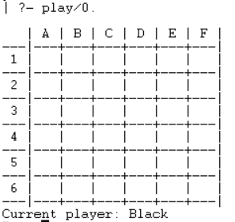
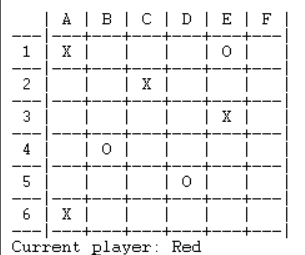
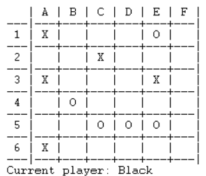

# PLOG 2020/2021 - TP1

## Group: T4_Gekitai4


| Name                 | Number    | E-Mail               |
| -------------------- | --------- | -------------------- |
| Caio Macedo Nogueira | 201806218 | up201806218@fe.up.pt |
| Telmo Costa Botelho  | 201806821 | up201806821@fe.up.pt |

----

## Gekitai

 - Gekitai is a 2-person strategy game created in 2020. It consists of two players, each with 8 pieces of a color that represents them, played on a 6 by 6 board where each player can place their pieces, one at a time in an empty space.
 - In order to win, one of the players must align 3 of their pieces in a row horizontally, vertically or in diagonal, or to have their 8 pieces on the board after making a move.
 -   However, it is not that easy to reach the goal because whenever a piece is placed, it “pushes” any adjacent piece that is free (not aligned by two or more pieces), pieces that fall from the board return to the players.
 - 
	**Material**  
		- Board 6 * 6;  
		- 16 Markers (8 of each color);
			
 - [source](https://boardgamegeek.com/boardgame/295449/gekitai)

----
## Internal representation of the GameState

**Board**
 * The board is represented by a list of lists, where each internal list represents a row of the board. Each cell can be an empty space, a red piece or a black piece.
  
	```[  
    [empty,red,black,empty,red,empty],  
    [empty,empty,empty,black,empty,black],  
    [black,empty,red,empty,empty,red],  
    [empty,black,empty,empty,empty,black],  
    [empty,empty,empty,red,empty,empty],  
    [black,red,empty,empty,black,empty]  
    ]
    ```  
 **Player**
 * Each player and empty cells are represented by a string. One colour is assigned for each player, 'Red' and 'Black'. A empty cell is just a space, " " . 
 
**GameStates**
 * **Initial Situation** 

 *   	[  
	    [empty,empty,empty,empty,empty,empty],  
	    [empty,empty,empty,empty,empty,empty],  
	    [empty,empty,empty,empty,empty,empty],  
	    [empty,empty,empty,empty,empty,empty],  
	    [empty,empty,empty,empty,empty,empty],  
	    [empty,empty,empty,empty,empty,empty]  
	    ]).  
	    
 *          | A | B | C | D | E | F |  
	     ---|---+---+---+---+---+---|  
	      1 |   |   |   |   |   |   |  
	     ---|---+---+---+---+---+---|  
	      2 |   |   |   |   |   |   |  
	     ---|---+---+---+---+---+---|  
	      3 |   |   |   |   |   |   |  
	     ---|---+---+---+---+---+---|  
	      4 |   |   |   |   |   |   |  
	     ---|---+---+---+---+---+---|  
	      5 |   |   |   |   |   |   |  
	     ---|---+---+---+---+---+---|  
	      6 |   |   |   |   |   |   |  
	     ---|---+---+---+---+---+---|  


 * **Intermediate Situation** 

*		[  
	    [red,empty,black,empty,black,empty],  
	    [empty,empty,empty,empty,empty,empty],  
	    [black,empty,empty,red,empty,empty],  
	    [empty,empty,empty,empty,empty,black],  
	    [empty,red,empty,empty,empty,empty],  
	    [empty,empty,empty,empty,red,empty]  
	    ].

*   	    | A | B | C | D | E | F |  
	     ---|---+---+---+---+---+---|  
	      1 | O |   | X |   | X |   |  
	     ---|---+---+---+---+---+---|  
	      2 |   |   |   |   |   |   |  
	     ---|---+---+---+---+---+---|  
	      3 | X |   |   | O |   |   |  
	     ---|---+---+---+---+---+---|  
	      4 |   |   |   |   |   | X |  
	     ---|---+---+---+---+---+---|  
	      5 |   | O |   |   |   |   |  
	     ---|---+---+---+---+---+---|  
	      6 |   |   |   |   | O |   |  
	     ---|---+---+---+---+---+---|  


 * **Final Situation** 
   
*	    [  
	    [empty,empty,empty,red,empty,empty],  
	    [empty,empty,empty,empty,empty,empty],  
	    [empty,black,empty,empty,red,empty],  
	    [empty,empty,black,empty,empty,empty],  
	    [red,empty,empty,black,empty,empty],  
	    [empty,empty,empty,empty,empty,red]  
	    ].

	        | A | B | C | D | E | F |  
	     ---|---+---+---+---+---+---|  
	      1 |   |   |   | O |   |   |  
	     ---|---+---+---+---+---+---|  
	      2 |   |   |   |   |   |   |  
	     ---|---+---+---+---+---+---|  
	      3 |   | X |   |   | O |   |  
	     ---|---+---+---+---+---+---|  
	      4 |   |   | X |   |   |   |  
	     ---|---+---+---+---+---+---|  
	      5 | O |   |   | X |   |   |  
	     ---|---+---+---+---+---+---|  
	      6 |   |   |   |   |   | O |  
	     ---|---+---+---+---+---+---|

## GameState Visualization

 * The board is printed with the call of the predicate `printBoard(X)`, that calls the predicate `printMatrix`. 
 * `printMatrix([Head|Tail], N)` is a recursive predicate, that calls `printLine([])`, also recursively, that prints each cell.
 * For a better display, we convert the values of the list for symbols "X", "O", and " ", respectively there are 'Black Player', 'Red Player' and empty cell.
	``` 
	symbol(1,S) :- S='Black'.
	symbol(2,S) :- S='Red'.
	symbol(empty,S) :- S=' '.
	symbol('Black',S) :- S='X'.
	symbol('Red',S) :- S='O'.
	```
 * Initial State:
		 
* Intermediate State:
		 
* Final State:
		 


